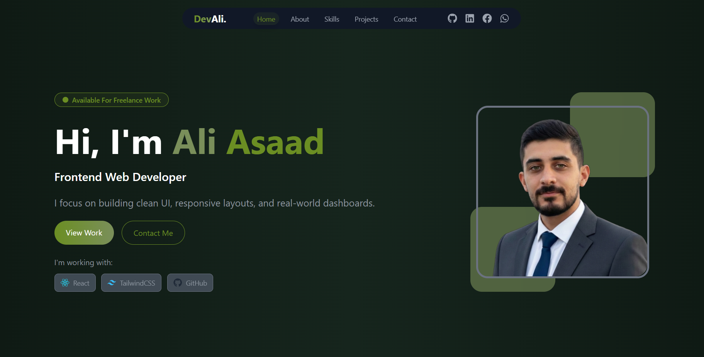
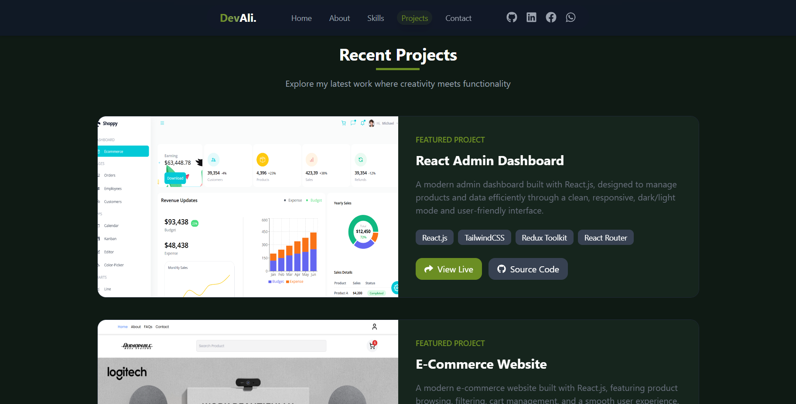

# 🚀 Personal Portfolio Website

A modern and responsive **Front-End Developer Portfolio** built with **React.js**, **Tailwind CSS**, and **Framer Motion**.  
This portfolio showcases my skills, projects, and experience with a clean UI, smooth animations, and modern design principles.

---

## 🌐 Live Demo

🔗 https://YOUR-VERCEL-LINK.vercel.app

---

## 📌 Features

- ⚡ Fully responsive design (Mobile / Tablet / Desktop)
- 🎨 Modern UI with dark theme
- 🎥 Smooth scroll & reveal animations
- 🧠 Clean and scalable code structure
- 🗂 Sections:
  - Hero
  - About Me
  - Skills
  - Projects
  - Contact
- 🔗 External links (GitHub, LinkedIn, Instagram, Facebook, Email)

---

## 📸 Screenshots

## 



---

## 🛠 Tech Stack

- **React.js** – Component-based UI development
- **Tailwind CSS** – Utility-first styling
- **Framer Motion** – Smooth animations & transitions
- **Vite** – Fast development & build tool
- **Lucide Icons & React Icons**

---

## 📂 Project Structure

````txt
src/
├─ components/
│ ├─ Navbar.jsx
│ ├─ Hero.jsx
│ ├─ About.jsx
│ ├─ Skills.jsx
│ ├─ Projects.jsx
│ ├─ Contact.jsx
│ └─ Footer.jsx
├─ index.css
├─ App.jsx
└─ main.jsx

---

## ⚙️ Installation & Run

Clone the repository:

```bash
git clone https://github.com/aliasaad01/portfolio-react-tailwind-framer.git
npm install
npm run dev

---
````

## 👨‍💻 Author

**Ali Asaad**

Front-End Developer | React.js

- GitHub: [https://github.com/aliasaad01](https://github.com/aliasaad01)

- ⭐ If you like this project, give it a star!
